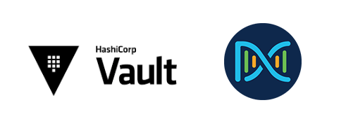
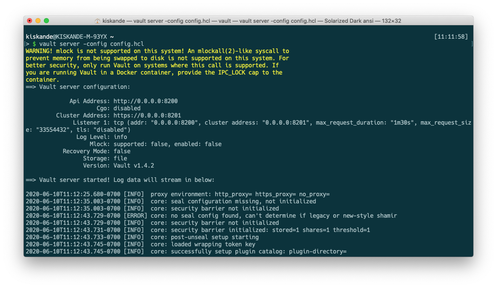

## Securing your API authentication keys with Vault


## What is Vault?
Vault is a tool for securely accessing secrets. A secret is anything that you want to tightly control access to, such as API keys, passwords, or certificates. Vault provides a unified interface to any secret, while providing tight access control and recording a detailed audit log.


## Requirements
 1. Download and Install [Vault](https://www.vaultproject.io/downloads)
 2. Download and Install [postman](https://www.postman.com/downloads/)
 3. Import the Postman collection and environment variable from project folder `Postman Collection`
 
 	⚠️ `Tests` are  written part of the collection to auto-update your Postman environment variables.
 
## Getting Started
#### Step 1: Start Vault
Once Vault is Installed, you first need to start it up. There are two options:



###### **Option #1:** Start it up in `dev mode` by supplying the following command in `Terminal`
```Bash
vault server -dev
```
 ⚠️ This option runs Vault storage in memory and hence once the server is stopped your config and keys are lost.
 
 ⚠️ If this is the option you choose, make sure you capture the `UNSEAL key` and `ROOT TOKEN` that's provided.
  
###### **Option #2:** Start it up with a pre-existing config. by supplying the following command in `Terminal`

 ⚠️  [Vault Config file](Vault-Config/config.hcl) 
 
```Bash
vault server -config config.hcl 
```
`config.hcl` this is what vault look for on startup. Here what it looks like 

```JSON
	{
	"listener": [{
	"tcp": {
	"address" : "0.0.0.0:8200",
	"tls_disable" : 1
	}
	}],
	"api_addr": "http://0.0.0.0:8200",
	"storage": {
	    "file": {
	    "path" : "vault/data"
	    }
	 },
	"max_lease_ttl": "10h",
	"default_lease_ttl": "10h",
	"ui":true
	}
```
**address** is the *vault* server address, that's the same address we will use to access the UI in a browser.

**storage.file.path** is the location where *vault* is going to create a file system for storage. set to `vault/data` change value as you see fit.

**ui:true** enables vault's UI interface.


### Step 2: Initialize and Configure Vault
Locate the provided Postman Collection folder, [import](https://learning.postman.com/docs/postman/collections/importing-and-exporting-data/) the `Vault.postman_collection` & `Vault-Env.postman_environment` [Found Here](Postman-Collection)  into Postman and env variable and start initializing vault using its APIs 

Assuming you chose to run vault using `Option #2` you will need to Initialize vault only once on initial run.

In Postman execute the following request:

⚠️ You only need to do the following once, upon initial setup of vault

1. `init vault` this will provide you with the `UNSEAL Key` and `Root Token`. save them.
2. `unseal vault` this will do what it says, unseal the vault before you can start accessing your secrets
3. `enable KV secret engine` [The KV secret engine](https://www.vaultproject.io/docs/secrets/kv) is used to store arbitrary secrets within the configured physical storage. In this case we are creating a new `mount` named `kv-v1` think of this as your path to secrets.

At this point you have everything you need to start storing API keys, Authentication and Token within your Vault instance.


### Step 3: Register Application
We don't want to give our application `Root` access, we want to register an [AppRole](https://www.vaultproject.io/docs/auth/approle) to authenticate our app against our instance of Vault. 

In the provided Postman collection:

1. `Add AppRole` this will setup a new AppRole authentication method within Vault.
2. `Add ACL Policy` Vault is driven by [policies](https://learn.hashicorp.com/vault/identity-access-management/iam-policies) to govern role based access. In this case we are creating a policy to give access to KV secret engine mount we created previously `kv-v1`. 

This is what the ACL Policy `my-policy` looks like:

```JSON
# Dev servers have version 1 of KV secrets engine mounted by default, so will
# need these paths to grant permissions:
path "kv-v1/devnet/dnac/*" {
  capabilities = ["create", "update","read"]
}
```
3.`Bind policy to role` this will do what is says. It will bind `my-policy` to `AppRole` we've created and call it `my-role`  


### Step 4: Generate App Token
To generate a new `CLIENT TOKEN` we will first need to Fetch our `Role ID` and generate a new `Secret ID` based on the role.

In the provided Postman collection:

1. `Get Role ID` fetches `my-role` ID created above. 
2. `Create Secret ID` using the `my-role` ID you will generate a new `Secrete ID` 
3. `Fetch Vault Token` this will generate a `client_token` for us to use to Create, Read and Update Secrets in the mount our ACL granted permission to in this case `kv-v1/devnet/dnac/*` **Use this in you application to authenticate, Capture It!**


### Step 5: Create Secret 
Now that we have all the pieces of the puzzle in place *(step 1-4 we only need to configure once)* we can now start storing secrets to be utilized by our application

1. `Post KV Secret` using the `client_token`, we will create a new secret. In this case we are using **Cisco DNA Center Sandbox**  and writing the secret to `kv-v1/devnet/dnac/sb1` 

⚠️ You will need to remember your `mount/paths` in order to access your secrets.


## Automation in code
[Provided sample code will](vault.py)
1. access Vault using `HVAC` library, and fetch the secret 
2. Authenticate against Cisco DNA Center always on Sandbox
3. Pull a list of managed Devices

- Before you run `vault.py`:

```shell
python3 -m venv venv
```
```shell
source venv/bin/activate
```
```shell
pip3 install -r requirements.txt
```

⚠️ Alter the `vault_unseal_key ` and `vault_client_token` based on your instance of Vault

```Python
# Instantiate new Vault CLIENT
client = hvac.Client()

# Capture UNSEAL key when initializing your Vault Server
vault_unseal_key = '04fbe3bd94d1716d298a99830cbef8bd587521c4f5dafe5e08142f4b4f31bfc2'
# Capture the CLIENT TOKEN here, provided by your admin (in this case see POSTMAN Collection)
vault_client_token = 's.FBp8nWrsTJgePWHvp2W59Nmv'

# Define your MOUNT POINT and PATH where your secrets are saved
vault_mount_point = 'kv-v1'
vault_path = '/devnet/dnac/sb1'
```

## SUCCESS
You have now integrated your application with a centralized vault that holds some, if not all your API Credentials and Tokens in a secure fasion. Imagine automating a multi-domain environment where you have different API calls to different endpoints, juggling Auth Token can be tedious and time consuming. Vault makes your life simple! Cool!


 
